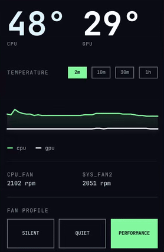
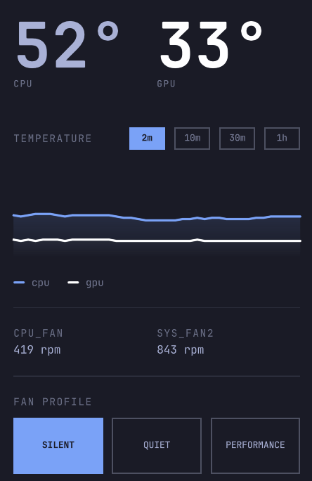
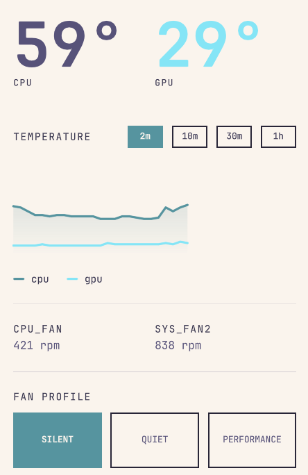
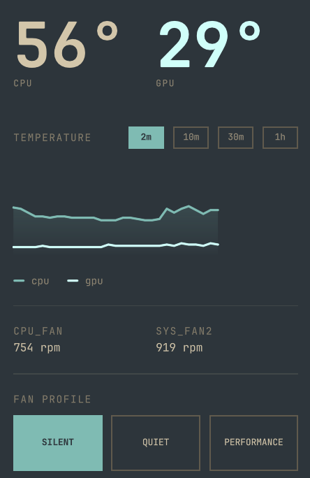
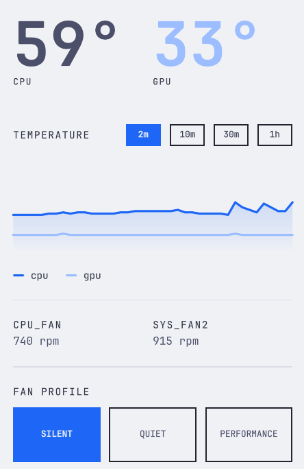
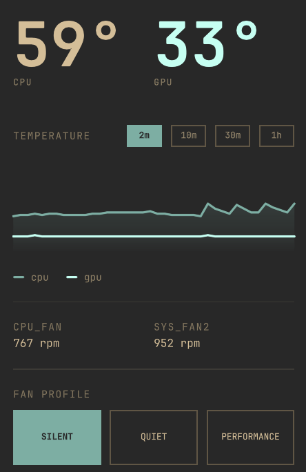
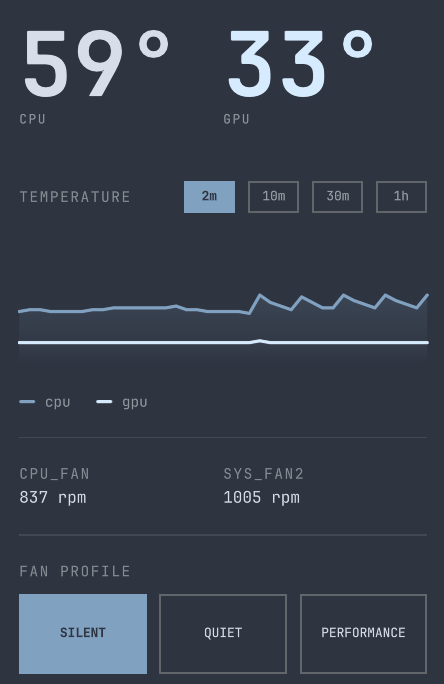

# Omarchy Temp + Fan Panel

A bar widget for [Omarchy](https://omarchy.org/) that shows live CPU/GPU
temperatures with a history chart, and lets you switch between four fan
curves (**Silent / Quiet / Balanced / Performance**) with one click —
no password prompt, no terminal.

<p align="center"></p>

Themes it, not your dotfiles — every color comes from Omarchy's own theme
tokens, so it just matches whatever you're running:

| | | |
|---|---|---|
|  |  |  |
| Hackerman | Rose Pine | Everforest |
|  |  |  |
| Catppuccin Latte | Gruvbox | Nord |

## Why this exists

Motherboard fan curves on Linux often default to something louder than
necessary, because the software that normally tames them (vendor fan-control
apps, e.g. Gigabyte's own tools) only exists on Windows. This project pairs
a standard `fancontrol` (lm_sensors) backend with a small Omarchy bar plugin
so you get the same kind of live control from your desktop.

## How it works

- **Fan control**: [`fancontrol`](https://github.com/lm-sensors/lm-sensors)
  runs as a systemd service reading temperature-to-PWM curves from
  `/etc/fancontrol`. `bin/fan-profile-set` rewrites that file with one of
  four preset curves and restarts the service.
- **Passwordless switching**: a sudoers rule scoped to the *exact* four
  `fan-profile-set <profile>` invocations (nothing else) lets the bar widget
  call it without a password each time. The helper script itself is
  root-owned and not writable by your user.
- **The bar widget** (`plugin/`) polls `sensors`/`nvidia-smi` every few
  seconds, keeps up to an hour of history in memory, and draws an
  area-line chart plus the profile switcher — all using your Omarchy
  theme's colors, so it matches whatever theme you're running.

## Hardware setup (read this first)

This depends on your motherboard's Super I/O chip being supported by the
`it87` Linux kernel driver and actually exposing PWM control. Some newer
board revisions aren't recognized by the in-kernel driver yet; if
`sensors` doesn't show an `it86xx`/`it87xx` chip after running
`sudo sensors-detect`, try the community-maintained
[`it87-dkms-git`](https://aur.archlinux.org/packages/it87-dkms-git) AUR
package (a fork by [frankcrawford](https://github.com/frankcrawford/it87)
that adds support for many chips the mainline driver doesn't recognize yet,
with the actual upstream kernel hwmon maintainer as a regular contributor).

```bash
sudo pacman -S lm_sensors
sudo sensors-detect          # answer YES to the Super I/O probing questions
sensors                      # look for an it86xx/it87xx chip

# if not found/recognized, install the patched driver (adjust for your AUR helper):
yay -S it87-dkms-git
sudo modprobe it87 force_id=0xXXXX   # chip ID from sensors-detect's output
```

Once the chip shows up, confirm the fan/pwm mapping with `sensors` — which
`pwmN` actually drives which physical fan varies by board. **Test carefully**
before trusting any curve on hardware you don't have a reference config for:
briefly set a channel to manual mode and a moderate PWM value, confirm the
right fan responds, then set it back to automatic (`echo 2 > pwmN_enable`)
before moving on. If a channel looks like it might be a pump rather than a
case fan, keep its minimum duty floor high (never let it approach 0%).

## Install

```bash
git clone https://github.com/Tentikewl/omarchy-temp-fan-panel.git
cd omarchy-temp-fan-panel
sudo ./install.sh
```

The installer:
1. Installs `/usr/local/bin/fan-profile-set` (root-owned)
2. Adds a sudoers rule scoped to exactly the four profile names, for your user only
3. Copies the plugin into `~/.config/omarchy/plugins/`
4. Enables the bar widget

## Customizing for your board

`fan-profile-set` auto-detects the hwmon device by name, but the
*fan-to-pwm-channel* mapping is board-specific and can't be auto-detected
safely. Edit the top of `/usr/local/bin/fan-profile-set`:

```bash
PWM_PRIMARY="pwm1"     # your primary/CPU fan header
PWM_SECONDARY="pwm3"   # your secondary fan header
TEMP_SOURCE="temp3"    # which temp sensor drives both curves
```

The four curves themselves (temp thresholds, min/max duty, averaging) are
plain shell variables in the same file — tune them to taste.

## Uninstall

```bash
sudo rm /usr/local/bin/fan-profile-set /etc/sudoers.d/*-fanprofile
rm -rf ~/.config/omarchy/plugins/community.temps-fan-panel
sudo systemctl disable --now fancontrol.service   # if you don't want it running anymore
```

## License

MIT — see [LICENSE](LICENSE).
